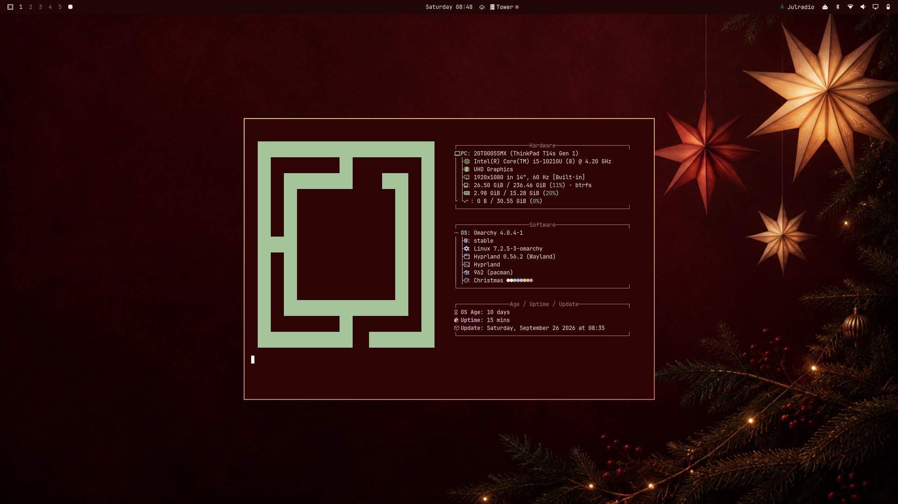

# Christmas for Omarchy

A Scandinavian Christmas theme with deep burgundy surfaces, candlelight text, brass-gold borders and evergreen accents.



## Installation

```sh
omarchy theme install https://github.com/b0d3ll/omarchy-christmas-theme
```

## Theme files

- `colors.toml`: application palette and window border colors.
- `shell.bar.toml`: burgundy status bar styling.
- `icons.theme`: Yaru-red icons.
- `unlock.png`: brass-gold Omarchy logo for the boot/disk-unlock screen (see `preview-unlock.png`).
- `backgrounds/01-christmas.png`: Christmas wallpaper.

Requires an Omarchy version supporting palette generation from `colors.toml` and `shell.bar.toml`.

## Color inspiration

The burgundy palette takes inspiration from [Julradio](https://www.julradio.se/), complemented by candle wax, brass and evergreen. No radio player, integration, site artwork or logo is included.

## Credits

The wallpaper is AI-generated.

## License

[MIT](LICENSE)
